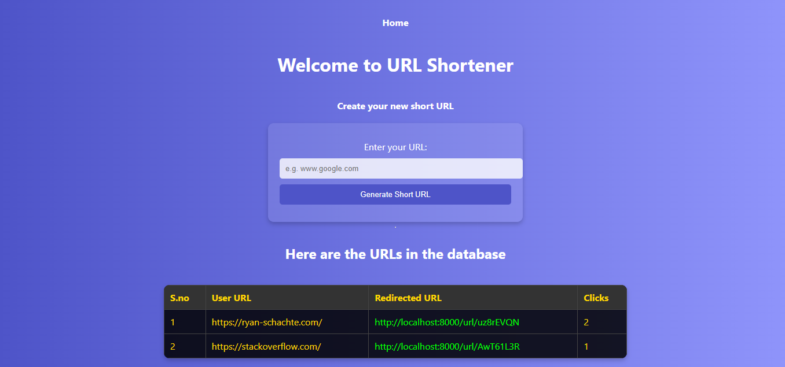
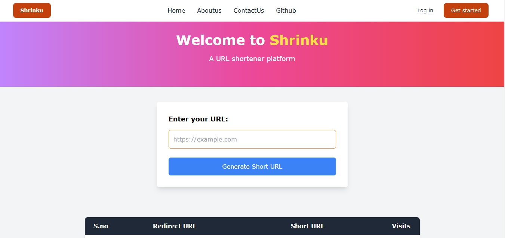

# UrlshortenerApp

## Description
UrlshortenerApp is a web application that allows users to shorten long URLs into more manageable links. It provides a simple and efficient way to create, manage, and track shortened URLs.

urlshortener with nodejs and server side rendering

[urlshortener.webm](https://github.com/user-attachments/assets/2f177101-6753-4225-af81-793893318d85)

shrinku with frontend vite and backend nodejs

[linkshrink.webm](https://github.com/user-attachments/assets/40984061-53f8-45e7-899d-d4b8e4e3db6f)


## Features
- Shorten long URLs
- Customizable short URLs
- Track click statistics
- User authentication and authorization
- RESTful API for URL management

## Installation
To get started with UrlshortenerApp, follow these steps:

1. Clone the repository:
    ```bash
    git clone https://github.com/yourusername/UrlshortenerApp.git
    cd UrlshortenerApp
    ```

2. Install dependencies:
    ```bash
    npm install
    ```

3. Set up environment variables:
    Create a `.env` file in the root directory and add the necessary environment variables. Refer to `.env.example` for the required variables.
--for shrinku app : go to shrinu folder
    ```bash
    PORT=3000 etc
    open cmd and type mongod if running on local machine then type mongosh for mongo shell
    MONGODB_URI=mongodb://localhost:27017/urlshort....
    like :Current Mongosh Log ID: 678299a167255b97be4eeb85                                                                                                                        Connecting to:          mongodb://127.0.0.1:27017/?directConnection=true&serverSelectionTimeoutMS=2000&appName=mongosh+2.3.7 
    
    ```bash
    then run : npm install to restore the node modules do for whenever you clone the project first time and use any of shrinku or urlshortenerapp
    ```
    frontend is vitejs and backend is expressjs so use npm run dev to run the project
    ```bash

4. Run the application: in backend directory
    ```bash
    npm start
    ```

## Usage
Once the application is running, you can access it at `http://localhost:3000`. Use the web interface to shorten URLs, or interact with the API using the following endpoints:

- `POST /api/shorten` - Shorten a new URL
- `GET /:shortUrl` - Redirect to the original URL
- `GET /api/stats/:shortUrl` - Get click statistics for a short URL

## Contributing
We welcome contributions to improve UrlshortenerApp! To contribute, follow these steps:

1. Fork the repository.
2. Create a new branch:
    ```bash
    git checkout -b feature/your-feature-name
    ```

3. Make your changes and commit them:
    ```bash
    git commit -m "Add your commit message"
    ```

4. Push to the branch:
    ```bash
    git push origin feature/your-feature-name
    ```

5. Open a pull request on GitHub.

